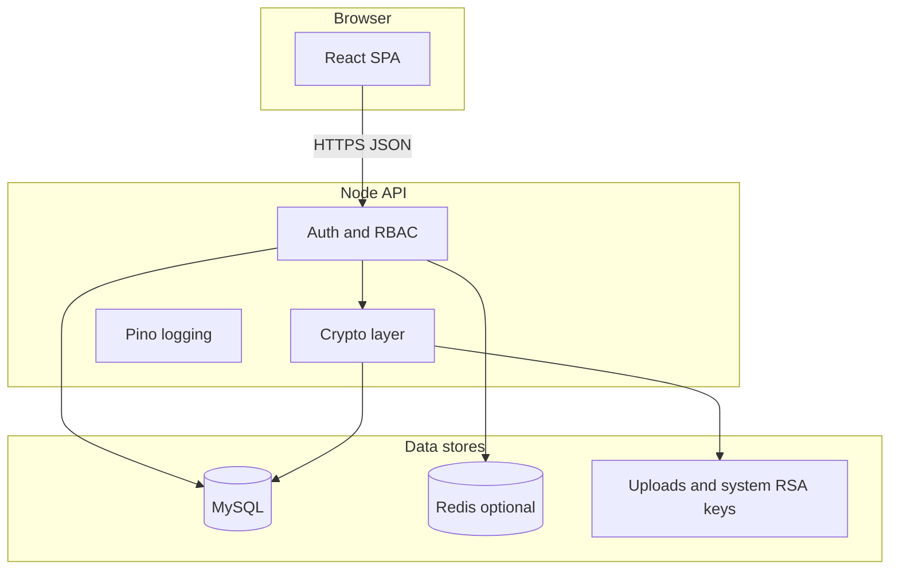

# CipherCampus architecture and security model

This document summarizes how the system is structured for reviewers and recruiters. It complements the course-focused README.

## Trust boundaries

- **Browser**: holds session token in `localStorage` (and optional httpOnly cookie from API). Does not perform application-layer decryption of stored ciphertext.
- **API**: enforces authentication (`authMiddleware`), authorization (`adminOnly`, ownership checks), validates input on auth routes, rate-limits `/api/auth`, and performs encrypt/decrypt before persistence.
- **MySQL**: stores ciphertext, password hashes, hashed identifiers, and session token hashes.
- **Redis** (optional, `REDIS_URL`): stores ephemeral 2FA OTP state so multiple instances or restarts do not lose in-flight logins.
- **Disk**: system RSA keypair (default under `backend/config/`, configurable via env) and encrypted document files.

## Threat model (what this design assumes)

| Concern | Mitigation in this project |
|--------|----------------------------|
| Database dump | Sensitive columns are encrypted or hashed; session table stores token **hash**. |
| Network eavesdropping | Use TLS in production; CORS restricted to `FRONTEND_ORIGIN`. |
| Brute-force login | Rate limiting on `/api/auth`; Argon2id password hashing. |
| Session theft | Short-lived JWT; DB session row; optional IP/UA binding checks. |
| Admin abuse of power | RBAC; admin routes gated; key rotation audited in `key_rotation_log`. |

**Not claimed**: protection against a fully compromised application host (attacker with filesystem + memory can unwrap keys), or against flaws in the educational RSA/ECC implementations used for coursework concepts.

## Educational vs production cryptography (interview script)

- **Production-facing boundaries** in this repo rely on **widely reviewed building blocks**: Argon2id for passwords, HS256 JWTs from `jsonwebtoken`, **AES-256-GCM** for post/document payloads (see `backend/crypto/postEnvelope.js`), and standard TLS expectations in deployment docs.
- **Course RSA/ECC modules** (`backend/crypto/rsa.js`, `ecc.js`, and call sites that encrypt profile fields or messages) exist to satisfy the **“implement asymmetric algorithms”** learning outcome. They are **not** presented as a replacement for audited libraries such as Node’s `crypto` WebCrypto-style RSA-OAEP or ECDH for new greenfield designs.
- **Credible story for reviewers:** *“Bulk secrecy and integrity use AES-GCM + HMAC with server-enforced policy; the custom RSA/ECC paths are isolated for coursework and labeled in docs. If I extended this, I’d migrate remaining wrapping steps to Node `crypto` while keeping the same data model.”*

## Cryptographic layout

- **Passwords**: Argon2id (`password_hash`); legacy custom hash still verified for older rows.
- **Sessions**: HS256 JWT (`jsonwebtoken`) with server secret `JWT_SECRET` (required strong secret in production).
- **Posts, documents (payloads)**: AES-256-GCM with a random key; that key is wrapped with the user or system RSA public key (project RSA implementation). Legacy post blobs (pure RSA character encryption) still decrypt via `decryptStoredContent`.
- **User private keys**: Wrapped with the **system** RSA keypair (`systemKeys`) and stored encrypted in `users`.
- **Messaging**: Existing ECC message format unchanged; documents/posts use the hybrid envelope where updated.

## Operations

- **Configuration**: See `backend/.env.example` and `frontend/.env.example`.
- **Docker**: `docker compose up --build` from this directory (MySQL seed + Redis + API + nginx frontend).
- **CI**: GitHub Actions runs backend tests (with MySQL service), frontend lint/test/build.

## Demo deployment

Set your real URL in hosting (and keep secrets out of Git). Placeholder until you ship:

- **`PUBLIC_DEMO_URL`:** `https://your-demo.example.com`

After deployment, smoke test **`/api/health`**, **`/api/ready`**, and **`/api/docs`**, then run through register → OTP → post in the browser.
